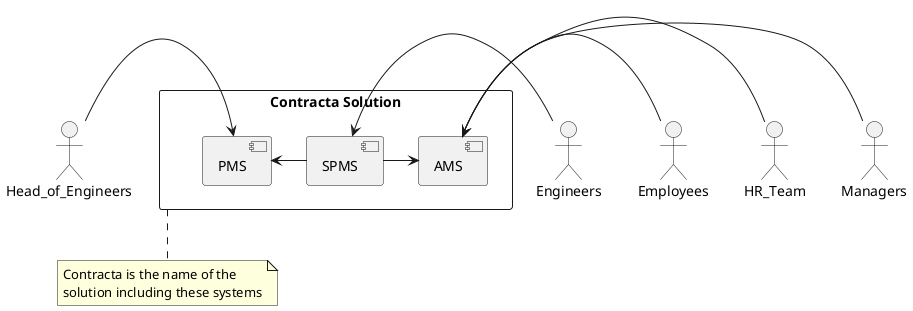

# Solution Architecture
<h5>The Contracta solution is designed to solve real estate company and building contractors managerial challenges revolving around project and human resource management and monitoring.
Contracta Systems:</h5>
1. Attendance Monitoring System (AMS).
2. On-Site Project Monitoring System (SPMS).
3. Project Management System (PMS).

* Components Diagram:
