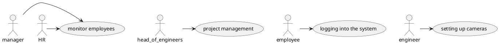

#Level one Use case
<h5>This describes the first level of the cases that the contracta users will face and how to use the systems

```plantuml
@startuml
actor engineer
actor head_of_engineers as he
actor HR
actor manager
actor employee

(monitor employees) as me
(logging into the system) as log
(project management) as pm
(setting up cameras) as sc

manager -> me
HR -> me
he -> pm
employee -> log
engineer -> sc
@enduml
```
