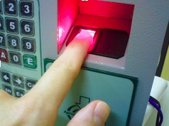
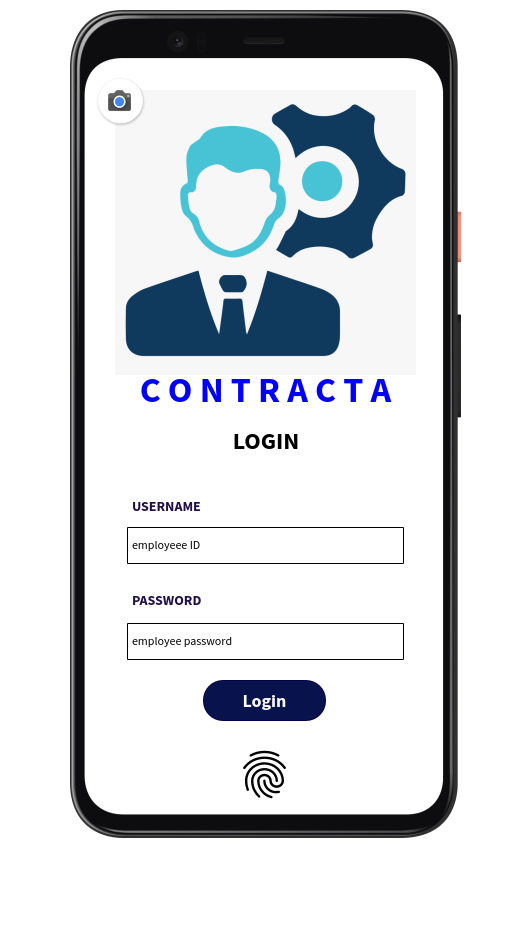

##Logging Employees into the System via AMS
#####Source: Mohammad Mohammadieh - RSC Owner
RSC requires the system to allow employees to check into (arrival) and check out (departure) of the system in order to monitor their attendance at any time needed at different locations.
- 4.1.1 The company headquarters
The input will be captured either via a biometric fingerprint scanner or a NFC card reader located at the company’s headquarters.

Fingerprint scanner example.

     
NFC card reader example.

- 4.1.2 On-site location
The input will be provided via the Contracta mobile application that can be used anywhere under a certain project location existing in the PMS.
* Mock:

#####Justification
The currently used system for attendance capturing is an outdated files oriented system in which the employees themselves fill a form manually when they arrive and leave with the time and date of it.
Because of RSC policies, attendance should be captured in an automated method with the time and date of arrival and departure being unbiased, also to ensure the actual attendance of each employee in the company which overall helps with their evaluation.
According to a current phenomenon, the company employees start attending after 10:00 AM
which is not the official opening time. and leave early on weekends which is not the company’s strategy.