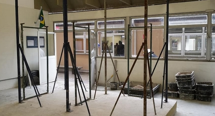

##Setting up on-site cameras via SPMS
#####Source: Mohammad Mohammadieh - RSC Owner
RSC requires a system where their engineer type of employees set up four cameras on each project site in four corners according to guidelines and standards that will be discussed later. 
The camera system is supposed take snapshots every period of time (changeable) and saved on the system’s digital photo recorder (DPR) on-site with the recording being migrated to the company’s servers manually every period of time (changeable) by the engineers themselves.

snapshot example
#####Justification
By taking snapshots of the processes on-site to be checked later, managerial and executive type users will be able to monitor the progress of the project for purposes such as project estimation calculations and investigations, as well as to ensure the attendance of the on-site employees.
